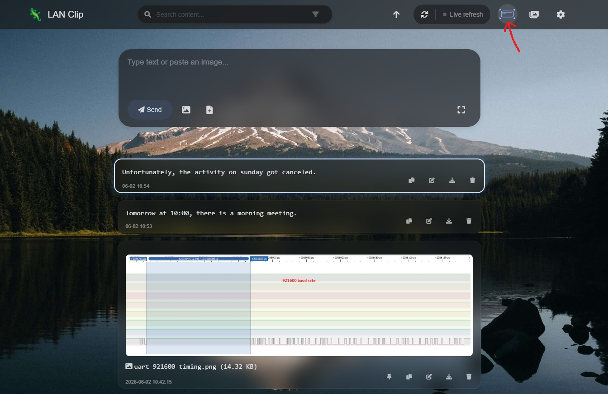

# LAN Clipboard
> LAN sharing tool / clipboard monitoring tool


Quickly share text, images, and files across your local network!
Highlights
- Supports text / image / file storage
- Automatically detects and converts URLs into hyperlinks
- High-speed transfer over the local network
- Windows tray mode
- Synchronized refresh across multiple devices
- Delete-all password: 1230 (can be changed in pwd.txt)
- Permission management: pinning, editing, and deleting posts require a password. (can be changed in pwd.txt)

## Shortcut Mode
You'll notice a small panel selection icon in the top-right corner. This is shortcut mode, which you can enable by clicking the button or pressing the Down arrow key in a blank area.
Once enabled, a card is selected. You can move with the arrow keys, c to copy, Enter to open the link/image, d to download, and Del to delete.
Batch deletion is very handy. No more aiming the mouse to click buttons.



## Clipboard Monitoring Mode
The default mode only provides web functionality. Clipboard monitoring mode can be started with the --tray argument.
Once enabled, a small green lizard appears in the tray. Right-click to start monitoring, and clipboard contents are automatically added to lan-clip.
- Windows users can launch it directly using traymode.vbs from the release.
- Mac users can ask an AI how to write a hidden launch command. Write your own and add it to your .zshrc file. For example: `alias lanclip="cd /Users/kasusa/Documents/GitHub/Lan-clip; nohup python3 app.py --tray > /dev/null 2>&1 &"`
- Linux users may need to modify tray_manager.py and run from the Python source code, since I've only tested the Windows and Mac versions.


# Installation and Startup
1. Windows desktop version

> Download the exe file from the Release page

2. Docker deployment (server)
bash

## Docker Hub Image
```bash
# Basic startup
docker run -d -p 5000:5000 kasusa/lan-clip:latest

# Persistent startup (recommended)
# Note: Before running, manually create the files, otherwise Docker will mistake them for directories and throw an error
sudo mkdir -p LAN-clip/cards LAN-clip/uploads LAN-clip/images
sudo touch LAN-clip/pwd.txt
echo "[]" | sudo tee LAN-clip/pinned.json
sudo chmod 777 LAN-clip

docker run -d -p 5000:5000 \
  -v $(pwd)/LAN-clip/cards:/app/cards \
  -v $(pwd)/LAN-clip/uploads:/app/uploads \
  -v $(pwd)/LAN-clip/images:/app/images \
  -v $(pwd)/LAN-clip/pinned.json:/app/pinned.json \
  -v $(pwd)/LAN-clip/pwd.txt:/app/pwd.txt \
  kasusa/lan-clip:latest
```

3. Run from source
```
python app.py
python app.py --tray # clipboard monitoring mode
```

## Changelog
2026-02-28
- Added a permission management feature; pinning, editing, and deleting posts require a password. (can be changed in pwd.txt)
2026-02-28 10:24:46
- Added download and delete buttons to each image in the gallery preview
- Added a "Settings → Compact mode" toggle to switch between experiences: normal mode keeps animations and large image previews, while compact mode is flatter, scrolls faster, and makes action buttons more prominent.
- Upload progress bar; a progress indicator is shown for files larger than UPLOAD_PROGRESS_MIN_SIZE
- Added password setting via pwd.txt
- Delete animation
- Double-click a card to enter highlight-card mode; use the arrow keys to move the selection, del/backspace to delete (after deleting, the next card is selected automatically), d to download, e to edit, c to copy (these only work while a card is highlighted)
- 2026-01-17
- Allow pinning cards
- No longer freezes the background when refreshing
- Added docker -v volume mounting for persistence
